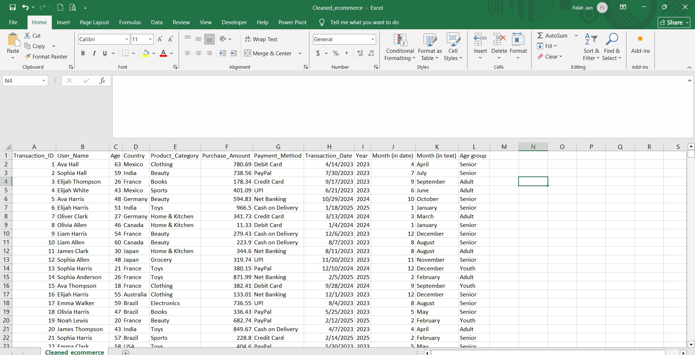

# Ecommerce-Customer-Spending-Analysis

An end-to-end E-commerce Customer Spending Analysis project leveraging **Excel**, **Python**, **MySQL**, and **Power BI** to transform raw data into business insights.
The process covers data cleaning, preprocessing, exploratory analysis, SQL-based querying, and interactive Power BI dashboards to identify spending trends and customer behavior for informed decision-making.

The project demonstrates expertise in data wrangling, SQL analysis, and business intelligence reporting. It serves as a strong portfolio example for aspiring and professional data analysts.

---

## 📘 Project Framework

- [🎯 Project Objective](#-project-objective)
- [📌 Business Objective](#-business-objective)
- [📊 Tools & Stacks](#-tools--stacks)
- [🔁 End-to-End Workflow](#-end-to-end-workflow)
- [🧹Data Preparation (Excel) & EDA in Python](#data-preparation-excel--eda-in-python)
- [🗃 SQL-Based Exploration](#sql-based-exploration) 
- [📈 Power BI Interactive Dashboard](#powerbi-interactive-dashboard)
- [⚙ How to Use This Project](#-how-to-use-this-project)
- [📂 Repository Structure](#-repository-structure)
- [📝 License](#-license)
- [📬 About Me](#-about-me)

---

## 🎯 Project Objective

This project analyzes customer spending behavior on an e-commerce platform.   to identify top customers, best product categories, and payment preferences.
It covers **Excel preprocessing, Python data analysis, MySQL queries, and Power BI dashboards** to create actionable business insights.

---

## 📌 Business Objective

- Understand **spending patterns** across customer segments.  
- Understanding **product category performance**.
- Detecting **payment method preferences** by groups.
- Creating **interactive visual tools** for quick decision-making.

---

## 📊 Tools & Stacks

| Tool        | Purpose                                                                  |
|-------------|-----------------------------------------------------------------         |
| **Excel**   | Initial cleaning, date splitting (Year, Month), and Age Group creation.  |
| **Python**  | EDA and visualization                                                    |
| **MySQL**   | Data storage and advanced queries                                        |
| **Power BI**| Interactive dashboard design and data storytelling                       |

---

## 🔁 End-to-End Workflow

Each stage seamlessly builds upon the previous one, resulting in a streamlined, production-ready pipeline that transforms raw, unstructured data into meaningful, actionable insights.

---

## 🧹 Data Preparation
**Excel Processing:**

### ✅ Step 1: Raw Data (Raw_data.xlsx)
- Contains columns like `Transaction_Id`, `User_Name`, `Age`, `Country`, `Product_Category`, etc.
- This is the simulated export from Ecommerce.

### ✅ Step 2: Split Transaction_date & created age group column 
- Split `Transaction_Date` into **Year** and **Month** columns.
- Converted numeric month to month names.
- Created **Age Group** categories (Youth, Adult, Senior) based on `Age`.

  
These were calculated using **Excel formulas**:

| Formula | Purpose |
|--------|---------|
| `Year(Transaction_Date)` | Split Transaction_date into year |
| `Month(Transaction_Date)` | Split Transaction_date into month (in date) |
| `Text(date,''mmmm'')` | Split Transaction_date into month (in text) |
| `=IF(B2<25, "Youth", IF(B2<45, "Adult", "Senior"))` | Assign Age group |

**EDA in Python**
